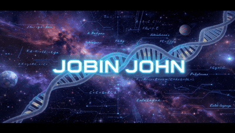

  

## Let's Connect!

## 💻 Tech Stack

  **Languages:**    

  **Bioinformatics:**  

  **AI/ML:**       

  **Databases:**   
  
  **Security:**   

  **Cloud:**    

## 🔨 Currently Working On

**Histopath_Agent** — AI model that reads breast tissue scans and classifies them by cancer risk, then writes up the findings in plain, readable language instead of just spitting out a number, tackling both the diagnosis and the trust problem that keeps a lot of medical AI out of real clinical use

  

**Cloud Cost Optimizer** — A SaaS tool that connects securely to a company's AWS account, spots the wasted spend hiding in idle or oversized resources, and turns that into clear savings recommendations, built as a real product with billing baked in from day one rather than just a portfolio demo.

  

